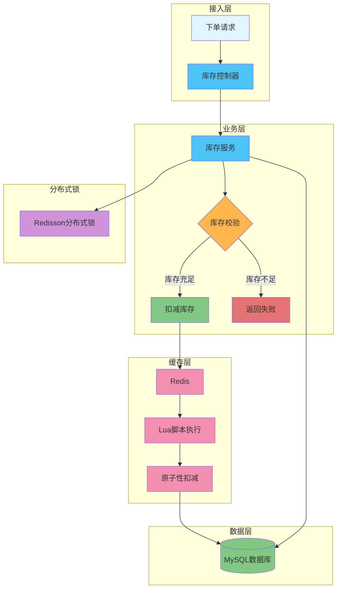
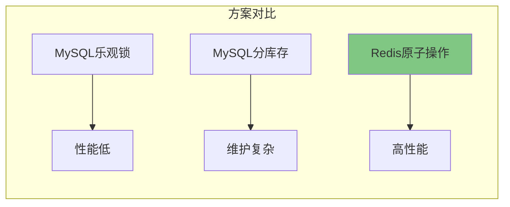
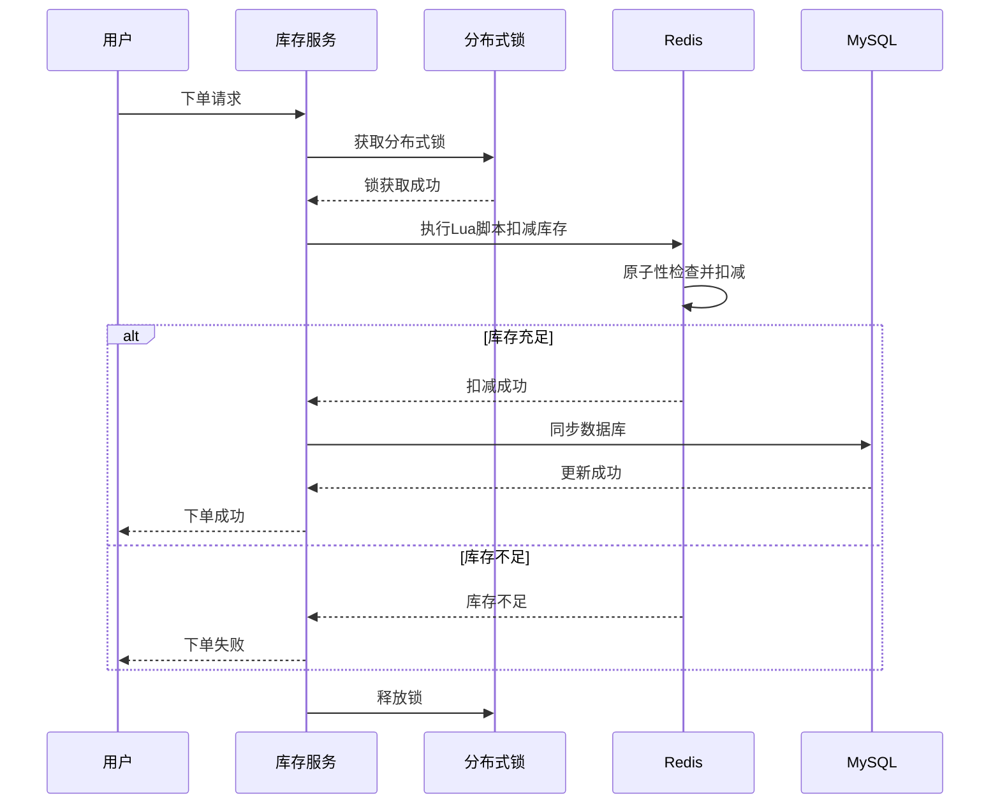
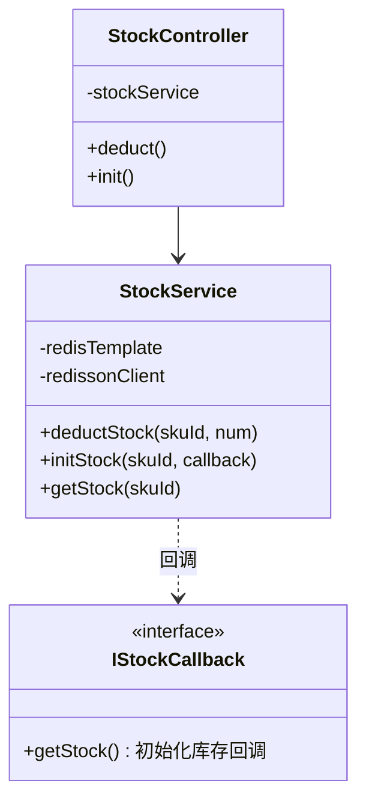

# st-storageManage
电商库存管理，防止超卖

## 项目架构

```mermaid
graph TB
    subgraph 接入层
        A[下单请求] --> B[库存控制器]
    end

    subgraph 业务层
        B --> C[库存服务]
        C --> D{库存校验}
        D -->|库存充足| E[扣减库存]
        D -->|库存不足| F[返回失败]
    end

    subgraph 缓存层
        E --> G[Redis]
        G --> H[Lua脚本执行]
        H --> I[原子性扣减]
    end

    subgraph 数据层
        I --> J[(MySQL数据库)]
        C --> J
    end

    subgraph 分布式锁
        K[Redisson分布式锁]
        C --> K
    end

    style A fill:#e1f5fe
    style B fill:#4fc3f7
    style C fill:#4fc3f7
    style D fill:#ffb74d
    style E fill:#81c784
    style F fill:#e57373
    style G fill:#f48fb1
    style H fill:#f48fb1
    style I fill:#f48fb1
    style J fill:#81c784
    style K fill:#ce93d8
```

## 防超卖解决方案

```mermaid
graph LR
    subgraph 方案对比
        A[MySQL乐观锁] --> A1[性能低]
        B[MySQL分库存] --> B1[维护复杂]
        C[Redis原子操作] --> C1[高性能]
    end
    style C fill:#81c784
```

## 库存扣减流程

```mermaid
sequenceDiagram
    participant U as 用户
    participant C as 库存服务
    participant L as 分布式锁
    participant R as Redis
    participant D as MySQL

    U->>C: 下单请求
    C->>L: 获取分布式锁
    L-->>C: 锁获取成功
    C->>R: 执行Lua脚本扣减库存
    R->>R: 原子性检查并扣减
    alt 库存充足
        R-->>C: 扣减成功
        C->>D: 同步数据库
        D-->>C: 更新成功
        C-->>U: 下单成功
    else 库存不足
        R-->>C: 库存不足
        C-->>U: 下单失败
    end
    C->>L: 释放锁
```

## 核心接口设计

```mermaid
classDiagram
    class IStockCallback {
        <<interface>>
        +getStock() 初始化库存回调
    }
    
    class StockService {
        -redisTemplate
        -redissonClient
        +deductStock(skuId, num)
        +initStock(skuId, callback)
        +getStock(skuId)
    }
    
    class StockController {
        -stockService
        +deduct()
        +init()
    }
    
    StockController --> StockService
    StockService ..> IStockCallback : 回调
```
